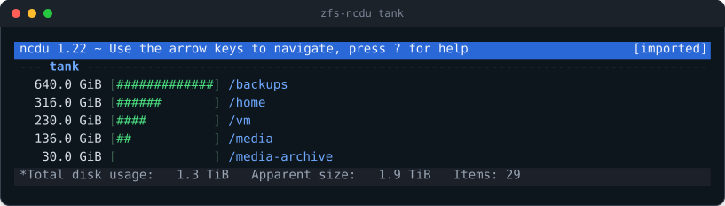
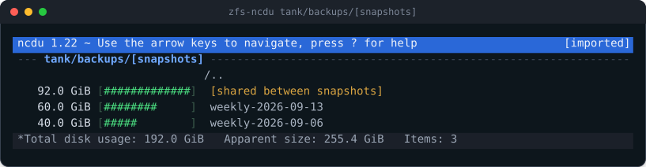

<h1>
  
  zfs-ncdu
</h1>

Browse ZFS space accounting in [ncdu](https://dev.yorhel.nl/ncdu).

[](https://github.com/Spaceghost/zfs-ncdu/actions/workflows/ci.yml)
[](LICENSE)

<br clear="left">



## Why

`du` cannot measure ZFS, and neither can ncdu scanning a mountpoint. Snapshots
hold blocks no live file references. Compression means the bytes on disk are
not the bytes in the files. Reservations consume space no file occupies. All of
that lives in dataset properties rather than in the filesystem namespace, so a
directory walk simply cannot see it — and a walk of a large pool is slow, while
the numbers ZFS already keeps are instant.

`zfs list` has the right numbers but the wrong shape: a flat table you read by
squinting at columns. ncdu has the right shape but no way to get the numbers.

## What it does

`zfs-ncdu` renders ZFS accounting into ncdu's own JSON export format and opens
it with the real `ncdu` binary. It is not a reimplementation of ncdu's
interface — the interface *is* ncdu, with its keybindings, sorting, graph and
`a` toggle intact.

Each dataset becomes a directory that contributes no bytes of its own. Its
space shows up inside it as:

| Entry | Contains |
| --- | --- |
| `[data]` | `USEDDS`, the dataset's own live data |
| `[refreservation]` | `USEDREFRESERV`, space reserved but not occupied |
| `[snapshots]/` | one entry per snapshot, plus `[shared between snapshots]` |

Disk size is bytes on disk; apparent size is the logical size those bytes
represent, so pressing `a` in ncdu switches between the compressed and
uncompressed view of the same tree.

## Install

Packages for every release are attached to the
[latest release](https://github.com/Spaceghost/zfs-ncdu/releases/latest):
`.apk`, `.deb`, `.rpm` and `.pkg.tar.zst`, all architecture independent,
with a `SHA256SUMS` beside them.

```sh
# Alpine
apk add --allow-untrusted zfs-ncdu_0.1.0_all.apk

# Debian, Ubuntu
sudo dpkg -i zfs-ncdu_0.1.0_all.deb

# Fedora, RHEL, openSUSE
sudo rpm -i zfs-ncdu-0.1.0.noarch.rpm

# Arch
sudo pacman -U zfs-ncdu-0.1.0-any.pkg.tar.zst
```

With Nix:

```sh
nix run github:Spaceghost/zfs-ncdu          # run it once
nix profile install github:Spaceghost/zfs-ncdu
```

Or from source. It needs `zfs`, any POSIX `awk` (tested against gawk, mawk,
original-awk and busybox awk) and `ncdu` to view the result:

```sh
git clone https://github.com/Spaceghost/zfs-ncdu
cd zfs-ncdu
make check          # run the test suite; needs no pools and no privileges
sudo make install   # PREFIX=/usr/local by default
```

`make install` honours `DESTDIR` and `PREFIX`, and `packaging/` carries an
`APKBUILD`, a `PKGBUILD` and the nfpm definition used to build the releases.
The script also runs straight from a checkout: `./bin/zfs-ncdu` finds its awk
library relative to itself, through symlinks.

## Usage

```sh
zfs-ncdu                      # every imported pool
zfs-ncdu tank/home            # one dataset and its children
zfs-ncdu -d 1 tank            # only one level down
zfs-ncdu -S tank              # summarise snapshots instead of listing each
zfs-ncdu -o tank.ncdu tank    # write an export, do not open ncdu
ncdu -f tank.ncdu             # read it later, anywhere
```

Reading ZFS properties normally needs privileges. `zfs-ncdu` runs `zfs`
unprivileged first, so [`zfs allow`](https://openzfs.github.io/openzfs-docs/)
delegation works, and only falls back to `doas` or `sudo` if that fails.
`--privilege` overrides the choice; `--privilege none` refuses to escalate.

See `man zfs-ncdu` for the full set of options.

## Accounting

For every dataset, ZFS maintains:

```
USED = USEDDS + USEDSNAP + USEDREFRESERV + USEDCHILD
```

The generated tree reproduces that identity exactly, so the total ncdu reports
for a dataset equals its `USED`. The test suite asserts this on every fixture.

Two subtleties are worth knowing, because they are where naive versions of this
tool go wrong:



**Snapshots share space.** A snapshot's own `USED` counts only the blocks
unique to it. Blocks held jointly by several snapshots are charged to none of
them, so listing snapshots individually totals *less* than `USEDSNAP` — on one
real pool, 37 GiB less. That remainder is reported explicitly as
`[shared between snapshots]`. Deleting one snapshot frees its own `USED`;
freeing the shared portion takes deleting all of the snapshots holding it.

**Pool totals differ from dataset totals.** `zpool list` counts raidz parity,
padding and pool metadata, which belong to no dataset. This tool reports
dataset accounting; it does not try to model pool geometry.

## How it works

```
zfs list -r -H -p -o name,used,usedds,usedsnap,usedrefreserv,compressratio
zfs list -t snapshot -r -H -p -o name,used,compressratio
        │
        └── lib/zfs-ncdu.awk ──> ncdu export format 1.2 ──> ncdu -f
```

Two `zfs list` calls, one awk script, no scanning. Runs in about a second on a
pool where a directory walk takes minutes.

One detail that is easy to get wrong: the rows must be sorted so a dataset is
immediately followed by its descendants, and a plain sort does not do that.
`-` (0x2d) sorts before `/` (0x2f), so `tank/data-old` lands between
`tank/data` and `tank/data/child` and breaks the nesting. The names are sorted
with `/` mapped to `\001` instead, which restores the order. There is a test
for it.

## Tests

```sh
make check              # or: ./tests/run.sh
./tests/run.sh mawk     # or any other awk
```

The suite runs on recorded `zfs list` output, so it needs no pools and no root.
It asserts that emitted totals match ZFS accounting, that the tree keeps its
shape, that the JSON parses and that ncdu imports it, when `python3` and `ncdu`
are available.

CI runs it under gawk, mawk, original-awk and busybox awk, on Ubuntu and on
Alpine, alongside shellcheck. A further job builds a real file-backed pool with
snapshots and asserts that the totals match what `zfs list` reports, which is
the property the whole tool rests on.

The images in this README are rendered from real ncdu output by
`doc/tools/term2svg.awk`, against the demo export in `doc/demo`, so they cannot
drift from what the tool actually draws.

## License

MIT. See [LICENSE](LICENSE).
